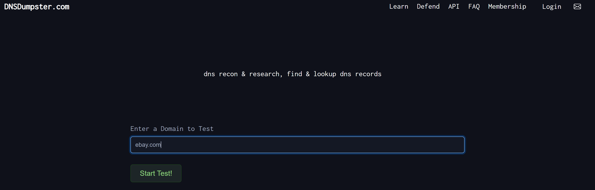
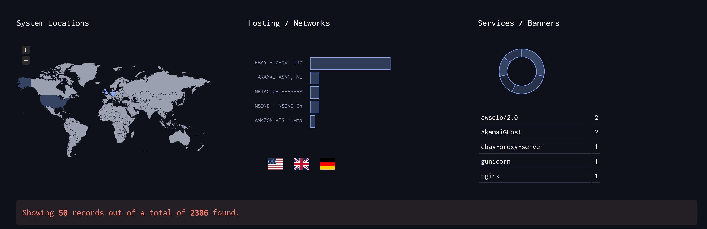
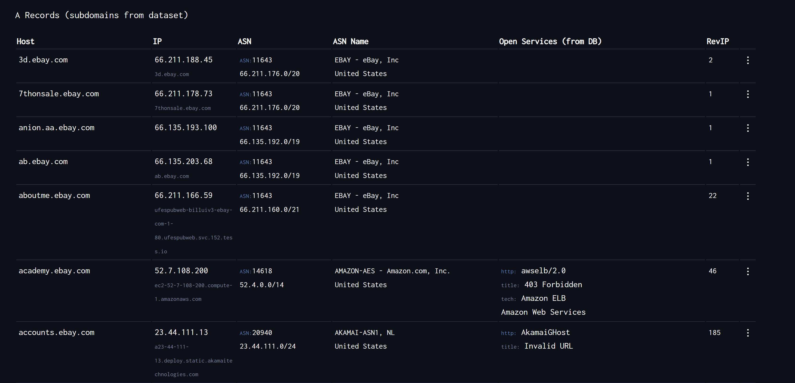
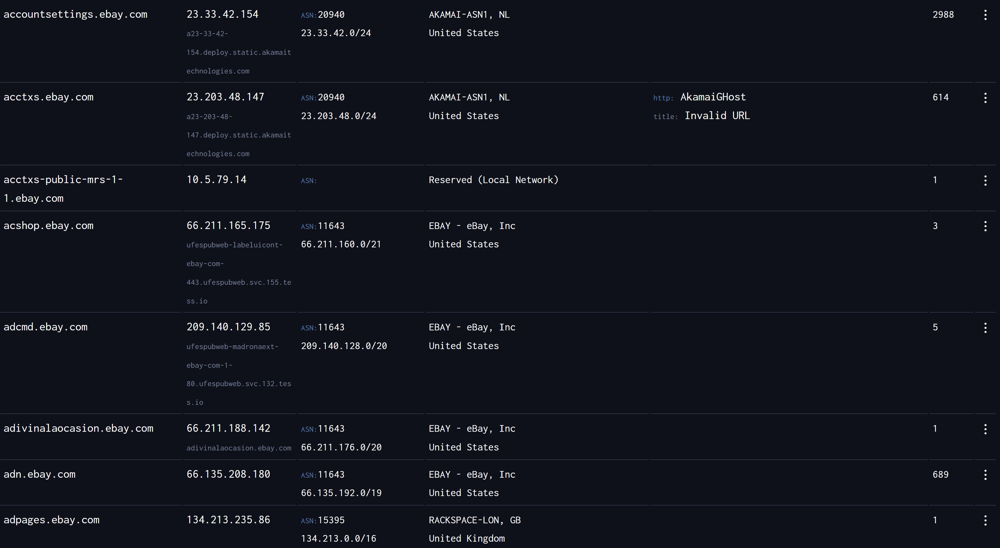
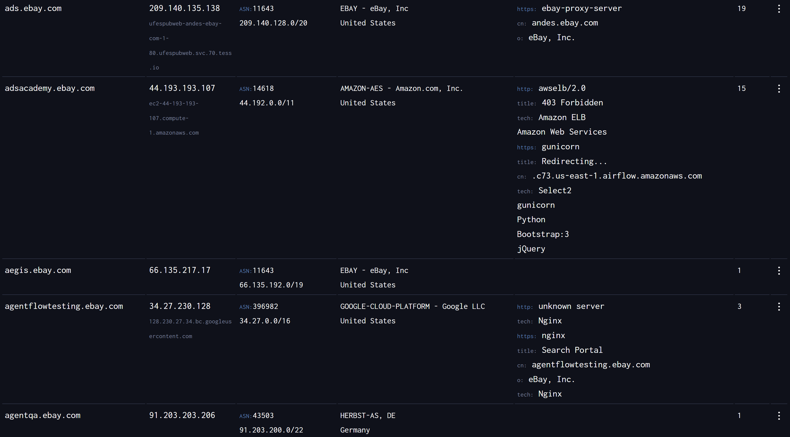
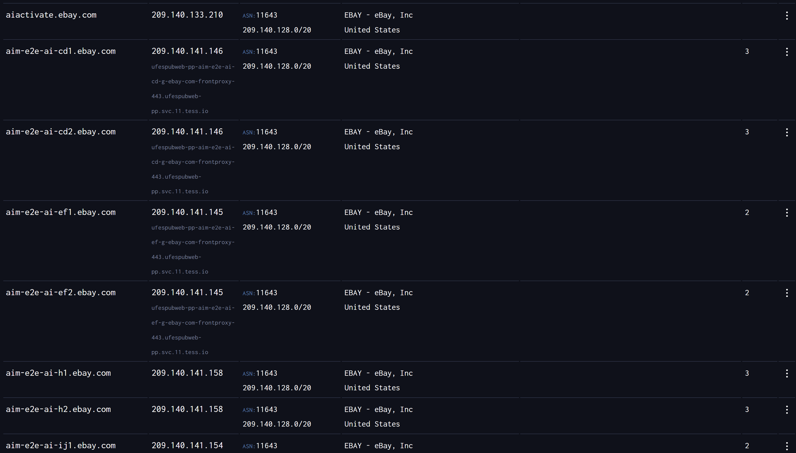
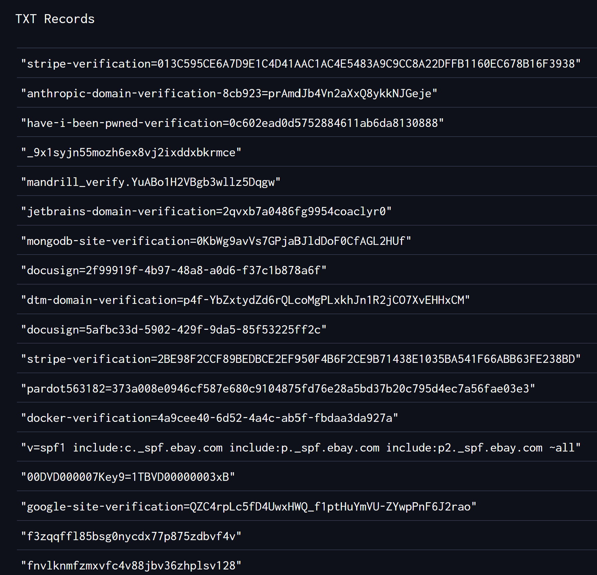

# Subdomain Enumeration and DNS Reconnaissance

## Objective

The goal of this lab was to perform passive DNS reconnaissance and subdomain enumeration against the target domain using publicly available information.

---

## Tool Used

- DNSDumpster

---

## Target

```text
ebay.com
```

---

## Methodology

The target domain was analyzed using DNSDumpster in order to identify:

- Subdomains
- IP addresses
- ASN information
- Hosting providers
- TXT records
- Service banners
- Publicly exposed infrastructure

Only passive reconnaissance techniques were used.

---

## Findings

The reconnaissance process identified a large number of publicly available subdomains and infrastructure components related to the target domain.

### Key Findings

- Over 2000 subdomains were identified
- Multiple hosting providers were observed:
  - AWS
  - Akamai
  - Google Cloud
- Authentication-related systems were discovered
- Testing and development-related subdomains were identified
- AI-related infrastructure was observed
- TXT records revealed multiple third-party integrations and domain verification records
- SPF records were identified for email protection

---

## Interesting Subdomains

| Subdomain | Observation |
|---|---|
| accounts.ebay.com | Authentication-related service |
| academy.ebay.com | Training or educational portal |
| ads.ebay.com | Advertising infrastructure |
| agentflowtesting.ebay.com | Possible testing environment |
| aim-e2e-ai-cd1.ebay.com | AI-related infrastructure |

---

## Screenshots

### DNS Reconnaissance Overview



### Subdomain Enumeration Results







### AI Related Infrastructure



### TXT Records





---

## Conclusion

The reconnaissance process revealed a large and distributed infrastructure utilizing multiple providers including AWS, Akamai and Google Cloud.

Several authentication, testing and AI-related subdomains were identified through passive DNS enumeration.

This lab demonstrates how publicly available DNS information can provide insight into an organization's external infrastructure and potential attack surface.

---

## Disclaimer

This project was performed for educational purposes only using passive reconnaissance techniques. No intrusive scanning or exploitation was conducted.
