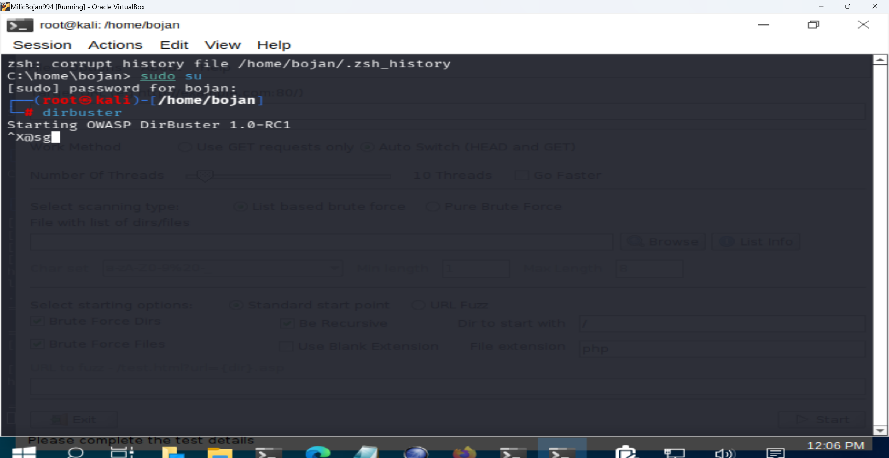
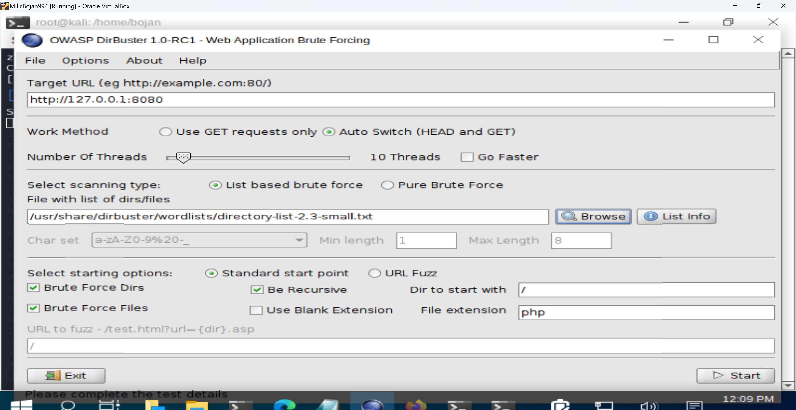
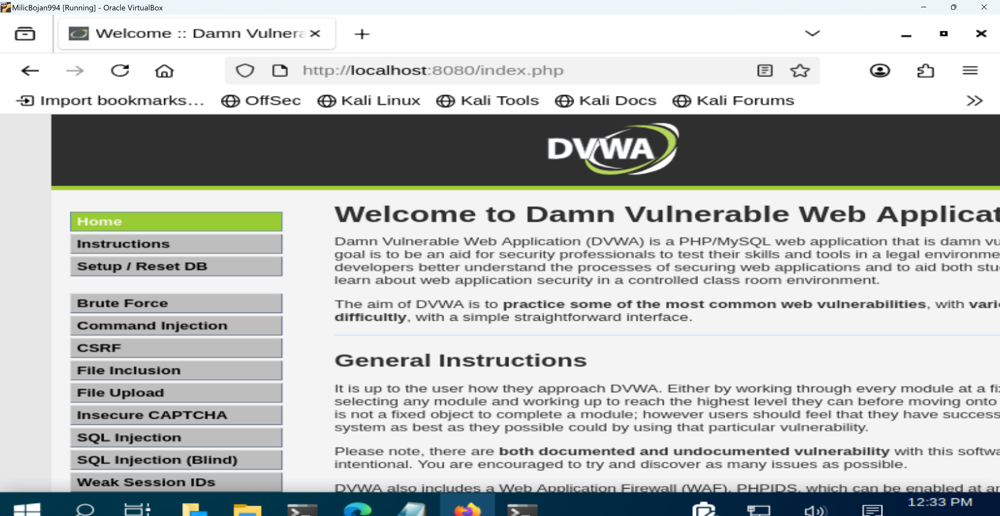

# DVWA DirBuster Enumeration Lab
# Lab Steps

## 1. Starting DVWA Container

The DVWA application was started inside a Docker container on Kali Linux using the following command:

```bash
sudo docker run --rm -it -p 8080:80 vulnerables/web-dvwa
```

This exposed the vulnerable web application locally on port 8080.


---

## 2. Configuring OWASP DirBuster

OWASP DirBuster was launched and configured to target the local DVWA application running on:

```text
http://127.0.0.1:8080
```

A standard directory wordlist was used for enumeration.


---

## 3. Starting Directory Enumeration

The scan was started using recursive directory and PHP file enumeration.

The objective was to identify accessible directories and files exposed by the web application.

.png)
---

## 4. Enumeration Results

DirBuster successfully identified multiple directories and PHP files including:

- `/login.php`
- `/setup.php`
- `/config`
- `/docs`
- `/vulnerabilities`

HTTP response codes such as `200`, `302`, and `403` were observed during the scan.

.png)

---

## 5. DVWA Target Application

The target application used in this lab was DVWA (Damn Vulnerable Web Application), running locally inside a Docker container.



---

# Conclusion

This lab demonstrated basic web application enumeration techniques using OWASP DirBuster against DVWA.

The exercise provided practical experience with:

- Directory brute-force enumeration
- PHP file discovery
- HTTP response analysis
- Web application reconnaissance

Such techniques are commonly used during penetration testing and security assessments.
